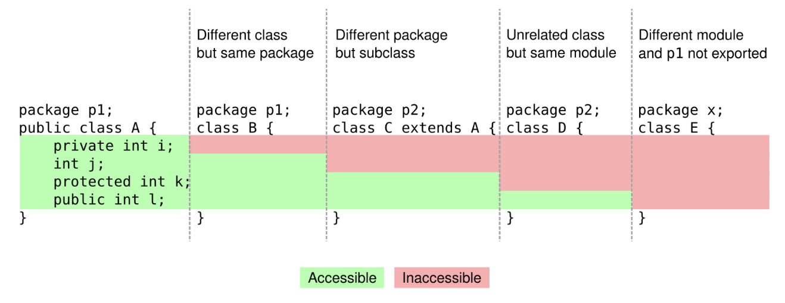

# Access Modifier

Private
Like you'd think, only the class in which it is declared can see it.

Package Private
It can only be seen and used by the package in which it was declared. This is the default in Java (which some see as a mistake).

Protected
Package Private + can be seen by subclasses or package members.

Public
Everyone can see it.

