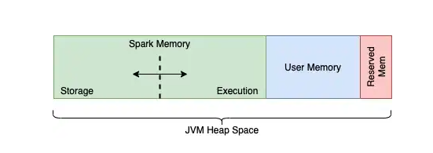
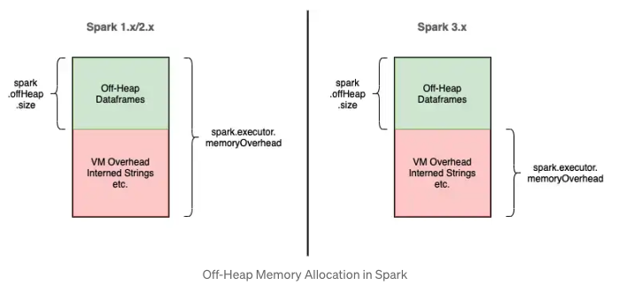
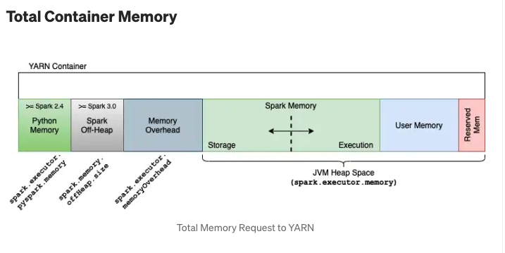

# Optimizing And Tuning Spark Applications


Spark Configuration

priority 

1. Application 내부에서 sparkSession에 설정한 값
2. spark submit 으로 제출하면서 configuration 설정
3. ${SPARK_HOME}/spark-defaults.conf 에 설정한 값

apply가  3-> 2 -> 1순으로 되면서, 앞에 값이 override 된다. 


checking spark configuration 
```scala
val mconf = spark.conf.getAll

// can check spark sql specific configuration 
spark.sql("SET -v").select("key", "value").show(5,false)

+------------------------------------------------------------+-----------+
|key                                                         |value      |
+------------------------------------------------------------+-----------+
|spark.sql.adaptive.enabled                                  |false      |
|spark.sql.adaptive.nonEmptyPartitionRatioForBroadcastJoin   |0.2        |
|spark.sql.adaptive.shuffle.fetchShuffleBlocksInBatch.enabled|true       |
|spark.sql.adaptive.shuffle.localShuffleReader.enabled       |true       |
|spark.sql.adaptive.shuffle.maxNumPostShufflePartitions      |<undefined>|
+------------------------------------------------------------+-----------+
```


Scaling Spark for Large Workloads

Static vs Dynamic resource allocation

- spark submit 에서 resource 지정 , limitation 설정할 수 있지만 태스크가 기다릴 경우에도 추가적인 자원할당이 불가능
- spark.dynamicAllocation.enabled(default false)를 true로 설정해서 dynamic allocation 가능
- schedulerBacklogTimeout -> 시간만큼 기다린 Task가 있다면 executor 요청

```
spark.dynamicAllocation.enabled true
spark.dynamicAllocation.minExecutors 2
spark.dynamicAllocation.schedulerBacklogTimeout 1m
spark.dynamicAllocation.maxExecutors 20
spark.dynamicAllocation.executorIdleTimeout 2min
```


### spark memory layout

spark runtime segregates JVM heap space 4 different parts

1. Storage Memory : JVM heap space reserved for cached data
2. Execution Memory : JVM heap spacke used by data-structures during shuffle operations(join/ group-by /aggregation)
3. User memory : Space for user code data structure
4. Reserved Memory : Reserved by Spark for internal purposes (300MiB)

in addtion to theses JVM heap, two more segments of memory space which are accessed by Sprk 

1. Off-Heap Memory : this segement of memory lies outside JVM , but used by JVM for certain use-case(internal string), Spark uses for serialized dataframes / RDDs
2. External Process Memory : Specific to PySpark / SparkR


spark.storage.memoryFraction vs spark.memory.storageFraction

- 1.6전 버전에서는 shuffle memory / storage memory 구분이 있어서, storage.memoryFraction / shuffle.memoryFraction으로 이 두 space를 manage 하지만 deprecated
- storage / execution memory가 동적으로 바뀌면서 spark.memory.fraction : portion of total memory dedicated to Spark, spark.memory.storageFraction : memory which is protected from eviction(0.5)

2G memory 

- reserved : 300mb
- spark memory : 1.7G * 0.6 (default) = 1.02G y 
    - 1.02G * 0.5(default) = 0.51G, execution , dynamically freed
    - 1.02G * 0.5(default) = 0.51G, storage, dynamically freed
- 0.68G  : user memory



### Off-Heap memory 

spark.executor.memoryOverhead vs spark.memory.offHeap.size

- spark use off-heap memory for two purpose
1. Spark explicitly store data as Project Tungsten
2. Java internally access String intern

- off heap 의 전체 사이즈는 spark.executor.memoryOverhead + spark.offHeap.size + (spark.executor.pyspark.memory)
- total offheap default는 max(10% executor memory, 384mb)
- spark.memory.offHeap.enabled : default(false) 로 dataframe이 offheap store 





### Project Tungsten on heap mode vs off heap mode

```scala
final val tungstenMemoryMode: MemoryMode = {
if (conf.get(MEMORY_OFFHEAP_ENABLED)) {
  require(conf.get(MEMORY_OFFHEAP_SIZE) > 0,
    "spark.memory.offHeap.size must be > 0 when spark.memory.offHeap.enabled == true")
  require(Platform.unaligned(),
    "No support for unaligned Unsafe. Set spark.memory.offHeap.enabled to false.")
  MemoryMode.OFF_HEAP
} else {
  MemoryMode.ON_HEAP
}
```

On heap mode
- tungsten 엔진은 객체를 인진수로 encoding, 자바 heap 내부에 Long 배열로 저장
- highly efficient / GC friendly
- The array-based storage format can help to reduce GC overhead though and it's even on the on-heap because there is rarely a need to serialize it back from compact array binary format
- https://stackoverflow.com/questions/43330902/spark-off-heap-memory-config-and-tungsten


Off heap mode
- spark가 offheap에 encoding한객체를 직접관리 
- offheap -> onheap -> offheap ser/deser 필요
- jvm은 존재를 모름 / 관리하지 않음


### Offheap mode in cluster mode(YARN)

https://www.waitingforcode.com/apache-spark/apache-spark-off-heap-memory/read


```scala
private[yarn] val resource = Resource.newInstance(executorMemory + memoryOverhead, executorCores)

```
Yarn 은 resource 할당시 spark offHeap property에 대해 unaware하다. 
Yarn이 tracking하지 못하는 Physical memory comsumption은 resource가 부족함에도 Yarn이 할당을 계속하는 문제를 발생

했었으나..

https://github.com/apache/spark/blob/7c7d7f6a878b02ece881266ee538f3e1443aa8c1/resource-managers/yarn/src/main/scala/org/apache/spark/deploy/yarn/YarnAllocator.scala#L140

https://github.com/apache/spark/commit/a07f795aead3bd81e7cccad30a7f6148c09ed8ad

offHeapMemory설정이 true일 경우, 해당 memory까지 고려해서 resource allocation

```scala
 private[yarn] val resource: Resource = {
    val resource = Resource.newInstance(
      executorMemory + executorOffHeapMemory + memoryOverhead + pysparkWorkerMemory, executorCores)
    ResourceRequestHelper.setResourceRequests(executorResourceRequests, resource)
    logDebug(s"Created resource capability: $resource")
    resource
  }
```


### Memory Management


(https://medium.com/walmartglobaltech/decoding-memory-in-spark-parameters-that-are-often-confused-c11be7488a24#7a05)


- executor.memory 4g 일 때 
- reserved 300
- sparkMemory 3.7g* 0.6 = 2.22g
- userMemory 3.7g* 0.4 = 1.48g
- memory.overhead 430mb 

-> yarn : 4.43 G needed 

- executor.memory  3g + memory overhead 1g
- reserved 300
- sparkMemory 3g * 0.6 = 1.8g
- userMemory 3g * 0.4 = 1.2g
- memoryOverHead 1g 

-> yarn : 4g needed


### Spark configuration tips

configuration | default | recommend | description 
-|-|-|-
spark.driver.memory| 1G | 1G (+) | 드라이버 할당 메모리, collect() 등을 쓰면 메모리가 부족할 수 있음
spark.shuffle.file.buffer | 32kb| 1mb | spark가 디스크에 쓰기전, 버퍼링을 할 수 있는 메모리양
spark.shuffile.transferTo| false | true | 스파크가 디스크 쓰기전 버퍼 여부, 파일 io 횟수가 준다.
spark.io.compression.snappy.blockSize|32kb| 512kb | snappy 압축 블록사이즈 크기
spark.shuffle.service.index.cache.size | 100m| 100m (+)| 캐시되는 엔트리 개수
spari.shuffle.registrationtimeout | 5000ms | 12000ms | 셔플 서비스 등록 대기 시간

