## Dynamic Partition Pruning


- Skip over data you don't need in query result
- It is usefule when join, especially when joining large dataset with small
    - fact table : large dataset , partitioned
    - dimension table : relatively small, non-partitioned


We learned about static partition pruning, which works by predicate pushdown(filter pushdown)


```sql
SELECT t1.id
WHERE t1.id < 2
```

Catalyst optimizer will make filter push down to datasource, which prevents full scan.

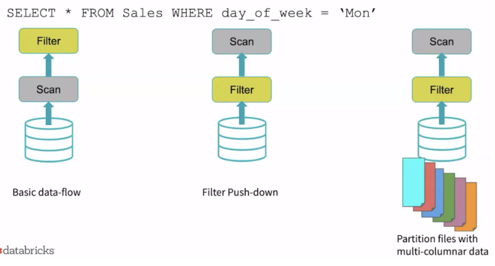


여러 테이블에 join 수행시, filtering 되는 Key 자체가 정해져있는 것이 아니라 동적으로 결정되기 때문에,
pruning 되는 조건문을 수행후, filter 적용

1. dimension side(작은 쪽) , build hash table by filter query 
2. plug the result of 1's query and broadcast variable to all executors
3. determine corresponding rows from the fact table
4. spark inject this filter dynamically into the file scan operation of the fact table

---

1. 작은 테이블에서 filtering 된 row 들의 hash table을 만든다.
2. hash table을 executor 에게 broad cast 한다. 
3. executor들은 이 hash table을 탐색하며 fact table에서 어떤 row를 읽어야 할지 결정한다. 
4. 이 결정된 row들을 fact table file scan 시 filter operation으로 동적으로 추가한다.

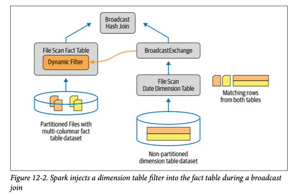


-> 33 times faster / 90+% less file scan

```sql
SELECT t1.id, t2.pkey
FROM t1
JOIN t2
WHERE t1.pkey = t2.pkey
AND t2.id < 2
```
here t1 is relatively small

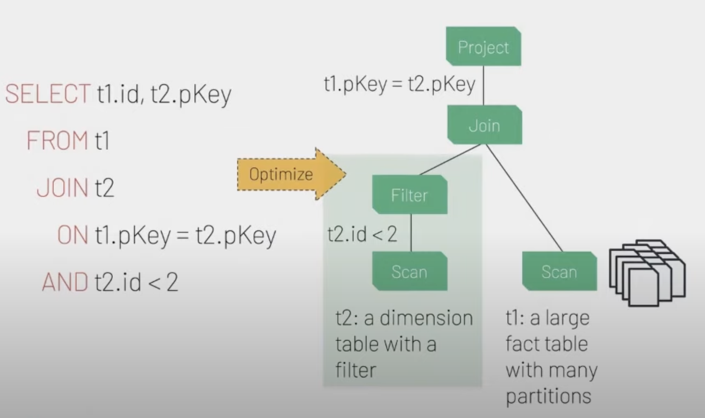
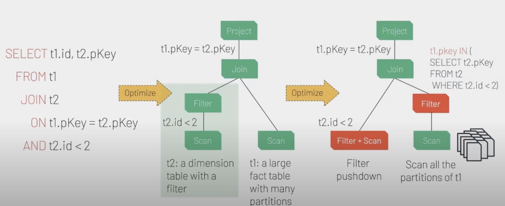


## Adaptive Query Execution

Spark reoptimizes and adjusts query plans based on runtime statistics collected in the process of query execution

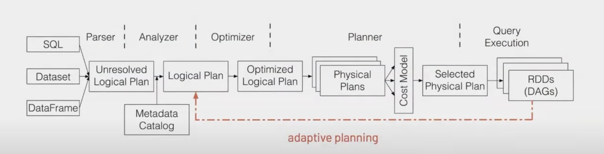
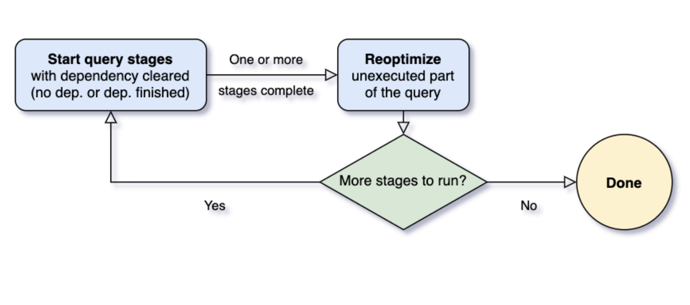


- Shrink the number of reducers in the shufflestage by decreasing the number of shuffle partitions
- Convert SortMergeJoin to BroadCastHashJoin
- Handle Skew join

useful when resuing computated partition again(cached)
optimization can be happened when cached data 
- partition is many / skewed 


### Dynamically coalescing shuffle partitions

- Shuffle의 partition 개수는 정해주지 않는한, data dependent 
- partition numbers differ vastly from stage to stage / query to query 
- if too few, each partition data size will be big, may need to spill to disk
- if too many, a lot of I/O fetch to read the shuffle block + burden to spark scheduler

- partiton의 size/ number는 데이터에 따라 달라진다. 특히 쿼리 중간에서 shuffling 이 발생하는 경우 데이터 파티션을 예측할 수 없기 때문에 tune이 어려움
- 만약 너무 많으면, 하나의 파티션의 크기가 커져서 data spill이 일어난다. 
- 만약 너무 적으면, network I/O 가 다수 일어나고, spark schduler 또한 burden이 간다.

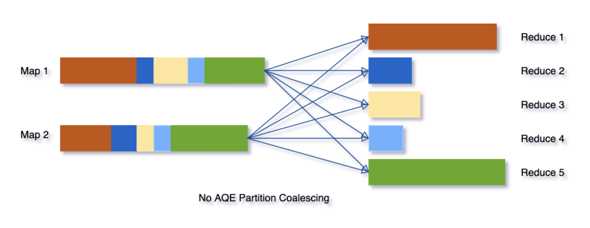

- map 이후 reduce shuffle에서 partition의 크기가 작은 세개의 partition을 task로 수행하려면
- scheduler가 scheduling을 해야하고, 만약 executor가 많지 않다면, task가 기다릴 수 도 있다.

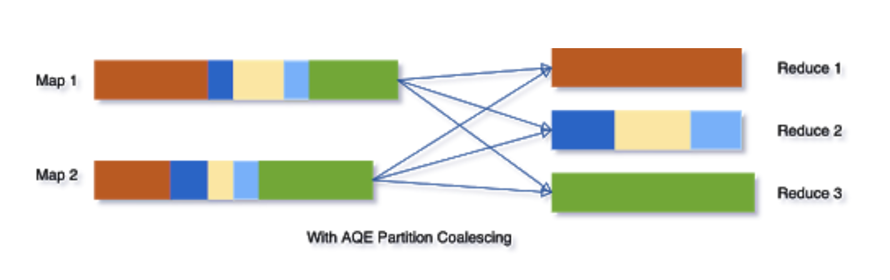

- 작은 partition들을 coalesce 해서 하나의 partition으로 task를 줄인다.

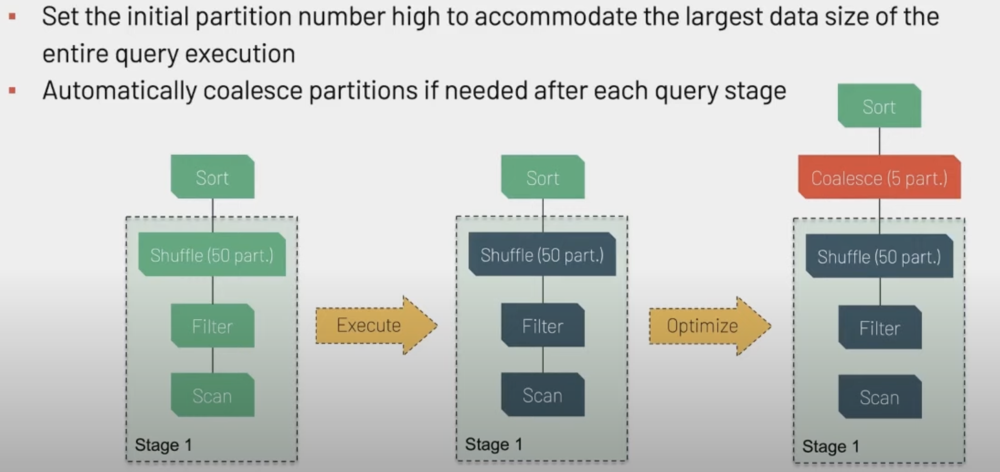


### Dynamically switching join strategies

- 가장 성능이 좋은건 broadcast hash join
- 설정한 broadcasthashjoin.threshold 보다 낮은 경우에 use BHJ 
- 그러나 shuffle 전 sort / filter 이후에 actual size가 작으면 기존 sortmergejoin strategy를 BHJ로 변경

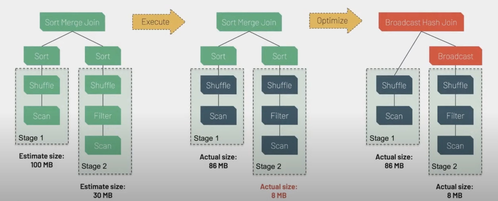


### Dynamically optimizing Skew joins

- Data skew가 문제가 되는 이유
    - 하나의 Task가 오래 걸리면서 뒤 stage가 전부 지체(every other partition waits)
    - disk spilling
    - low resource optimization
    - OOM


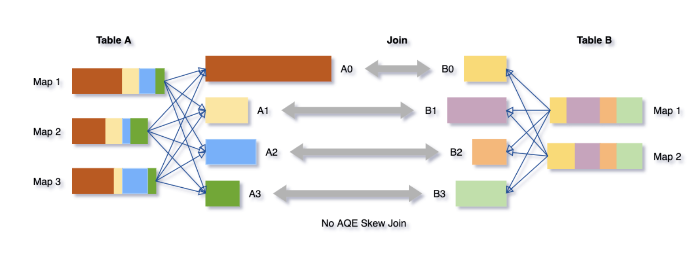

- subpartition skewed partition 
- duplicate corresponding partition 

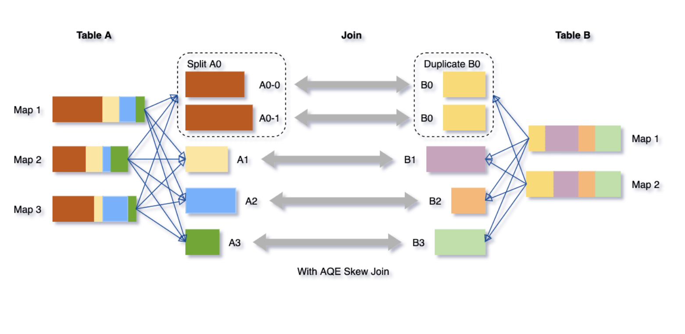

- will make more task, but each task processing time will be similar


https://www.databricks.com/blog/2020/05/29/adaptive-query-execution-speeding-up-spark-sql-at-runtime.
https://www.youtube.com/watch?v=g-qZslQsOuE&t=813s


## AQE conceptual steps

1. All leaf node / each stage executed
2. Each materialization point(shuffle, stage end), all relevant statistics(partition number, byte of data read) gathered, update logical plan
3. Spark runs catalyst optimizer
- coalesce the number of partition 
- replace sort merge join based on size of tables read with broad cast join
- skew join remedy
4. Create a new optimized logical plan  -> which will converted to optimized physical plan

---


## SQL Join hints

Catalyst Optimizer보다 더 자신있으면 사용

### Shuffle sort merge join
- suggest spark to perfrom SortMergeJoin when joining table
- /*+ ${HINTS} /*

```SQL
SELECT /*+ MERGE(a, b) */ id FROM a JOIN b ON a.key = b.key
```

### Broadcast Hash join
- BHJ hint 를 주게 되면, BHJ threshold 보다 table이 크더라도, 사용하게 됨
- https://blog.madhukaraphatak.com/spark-3-introduction-part-

```SQL
SELECT /*+ BROADCAST(a, b) */ id FROM a JOIN b ON a.key = b.key
```
### Shuffle hash join

```SQL
SELECT /*+ SHUFFLE_HASH(a, b) */ id FROM a JOIN b ON a.key = b.key
```
### Shuffle-and-replicate nested loop join

```SQL
SELECT /*+ SHUFFLE_REPLICATE_NL(a, b) */ id FROM a JOIN b ON a.key = b.key
```


