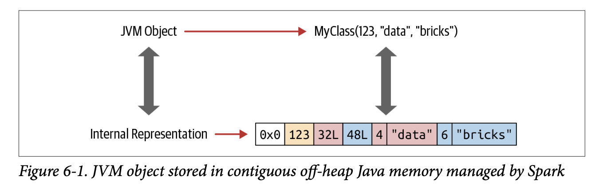
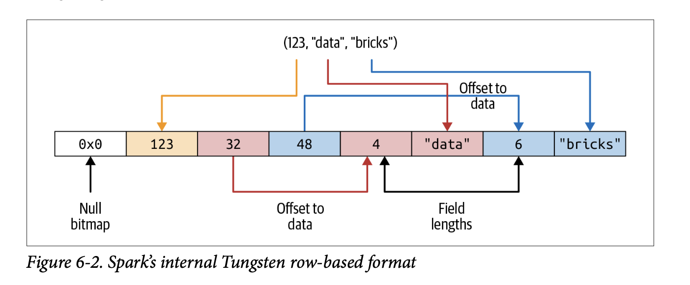
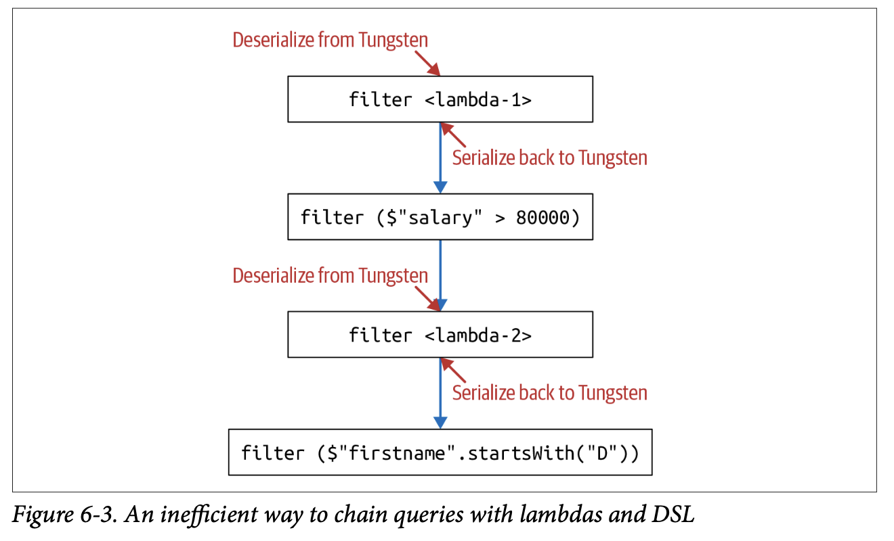

### Memory Management for Datasets and DataFramses

- 스파크는 메모리 기반 엔진이기 때문에 메모리 최적화 매우 중요 

## Spark Memory Evolution

- Spark 1.0 RDD based java object form memory storage / serialization / deserializaiton 
- expensive resource 
- storage allocated in java heap -> performance by GC 

- Spark 1.0 Project tungsten 
- internal row format -> layout Datasets / DataFrames in offheap using offheap pointer 

- Spark 2.0 second gen tungsten engine
- whole-stage code generation / vectorized column-based memeory layout
[source]<https://www.databricks.com/blog/2016/05/23/apache-spark-as-a-compiler-joining-a-billion-rows-per-second-on-a-laptop.html>


## Dataset Enconder
 
- Encoder : off-heap memory의 데이터를 스파크의 내부 텅스텐 포맷에서 JVM 자바 오브젝트로 변환한다. 
- 스파크 내부 형식 원시 데이터 -> JVM 객체로 데이터 셋 직렬화 / 역직렬화

JVM Object <-------Encoder-------> Dataset<T>
 
```java
Encoder<UsageCost> usageCostEncoder = Encoders.bean(UsageCost.class)
```


## Spark Internal Format VS Java Object Format

- 자바 객체는 overhead가 큼
- Spark 는 offheap 쪽에 데이터를 레이아웃(할당)
- data는 contiguous manner and accessible through pointer arthimetic/offset 
- encoders can quickly serialize or deserialize



## Serialization / Deserialization 

- data가 cluster에서 network를 통해 분산처리 될때, serialization / deserialization이 이루어진다.
- JVM 은 serializer / deserializer 가 존재하지만, inefficient 
- DataEncoders는 아래와 같은 장점 보유
- Spark tungsten binary format으로 data를 offheap에 저장하기 때문에 compact ( less space )
- Encoder는 pointer/ memory  연산으로 serialization을 빠르게 수행할 수 있음
- Encoder는 binary -> spark tungsten binary 로 빠르게 deserialization 할 수 있음 (null bitmap으로 가르기만 하면 될 것 같은? )




## Cost of using Datasets

- DataFrame vs Dataset했을 때 dataset을 쓰는 것의 cost가 있음 
- dataset은 filter/  map/ flatmpa같은 Highorder에 Lamda를 인수로 받음
- 람다를 처리하기 위해, internal tungsten format -> JVM object로 deserialization이 필요함 
    - 네트워크 ---> 스파크 텅스텐 ----> JVM 
    - 하지만 그렇게 크지는 않다. 데이터가 많아지면 영향이 있을 수 있다.


## Cost를 줄이는 방법

- avoid excessive use of lambdas as anonymose function 
- Spark가 알 수 없기 때문에, Cayalyzst optimizer가 할 수 있는게 없다 
- tell spark what to do, not how to do


- chain queries together in way that ser/deser is minimized

```scala
personDS
.filter(x => x.birthdate.split()...) 
.filter($"salary" > 80000)
.filter(x => x.lastName.startsWith("J"))
.filter($"firstName".startsWith("d"))
.count()

```




```scala
personDS
.filter($"salary" > 80000)
.filter($"firstName".startsWith("d")) /
.filter(x => x.birthdate.split()...) //deser
.filter(x => x.lastName.startsWith("J")) 
.count()
```
or no lambdas

```scala
personDS
.filter(year($"birthDate") > earliestYear) // Everyone above 40 
.filter($"salary" > 80000) // Everyone earning more than 80K 
.filter($"lastName".startsWith("J")) // Last name starts with J 
.filter($"firstName".startsWith("D")) // First name starts with D .count()

```


