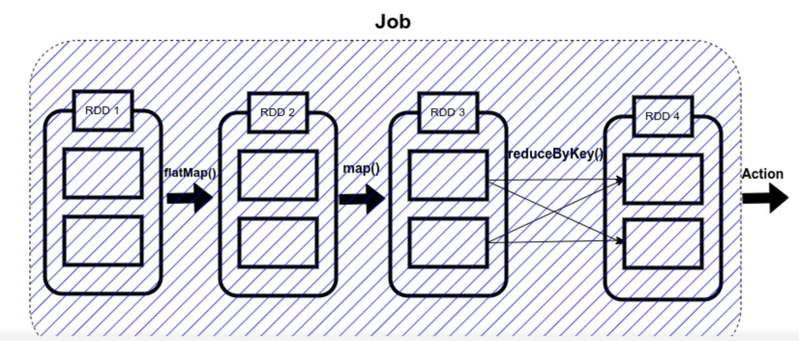
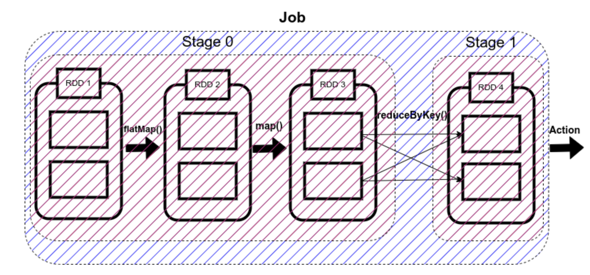
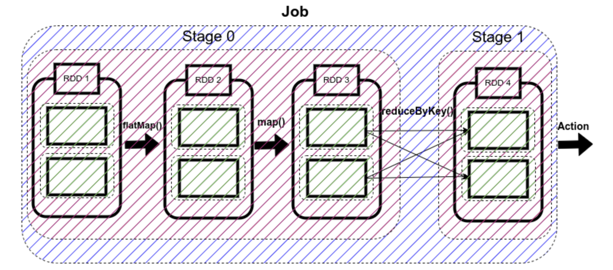
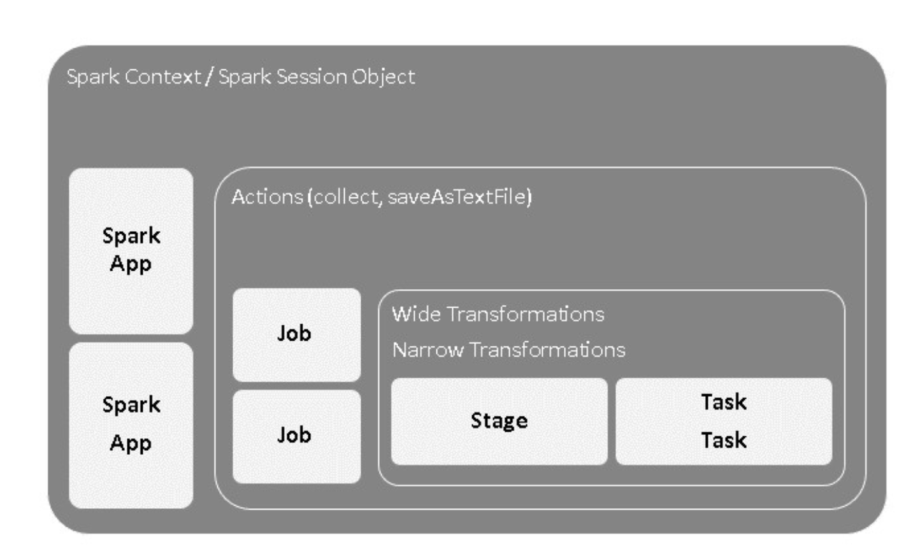
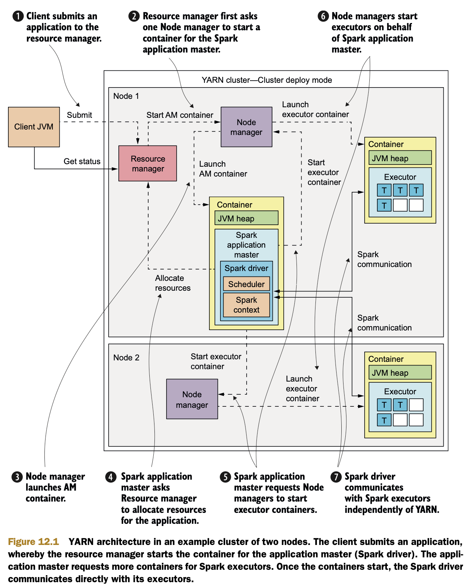
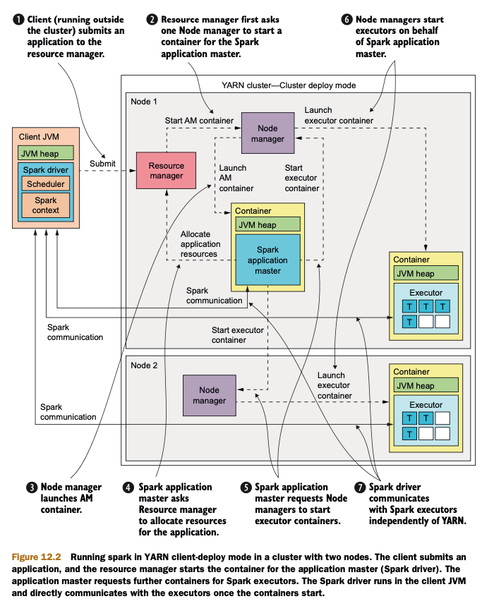

## Job / Stage / Task 

https://www.linkedin.com/pulse/4-key-concepts-anatomy-apache-spark-job-kumar-chinnakali


### Spark Jobs

- Spark action(e.g. save(), collect())에 대한 응답으로 생성되는 여러 stage로 이루어진 병렬 연산
- save() / collect() 등 연산이 있을 때 spark application 은 single job 생성




### Spark Stages

- shuffling 이 일어나는 연산이 있을 때, spark 는 job을 multiple stage로 나눈다.
- stage들은 DAG dependency에 따라, parallel / sequential 하게 수행된다
- Stage 0 / Stage 1이 존재할 때 Stage 0 -> Stage 1 로 dependency 가 있으면 sequential 하게 수행되고, 아니면 parallel 하게 수행될 것 




#### Spark Stage - ResultStage (1)

- final stage in a Job 

#### Spark Stage - ShuffleMapStage ( 0 - N )

- DAG의 물리적 실행 안에서 중간 stage로 생각하면 됨
- 후속 stage들이 실행하기 전에 데이터의 재배치(redistribution)이 발생
- ResultStage를 computing하기 위해서 필요한 stage
- 이 stage의 결과로 output file이 만들어지며 이 file은 partition되어 후속 stage가 사용


### Spark Task
- single unit of execution 
- will be sent to executor
- each task maps to single core / works on as single partition of data
- executor with 16 core can work on 16 task ( 16 partitions )





### DAG 

- A DAG is Directed Acyclic Graph which is built by layer of RDD dependencies with stages for each Spark application job.
- And it can be called as DAG scheduler in the Spark API context. It builds a graph for any Spark job submitted, and it determines the locations to run each task


## How Spark Runs Your Applications

https://developer.hpe.com/blog/how-spark-runs-your-applications/


## Spark execution in YARN 

Yarn architecture

- resource manager 
- node manager
- container
- application master 
-



Resource Scheduling in YARN

- ResourceManager has pluggable resource scheduling interface 
- 자원 할당 전략을 변경할 수 있도록 
- FIFO 
- Capacity 
- Fair

can be set by property 
```
yarn.resourcemanager.scheduler.class
```

FIFO Scheduler

- application은 원하는 리소스를 전부 할당 
- 만약 두개가 동시에 하나의 리소스를 원한다면, 먼 저 제출된 application부터 할당

Capacity Scheduler

- default scheduler in YARN 
- single YARN cluster를 share하기 위해 design
- Queue 할당
- queue에는 capacity 가 존재
- quque에는 hierarchy가 존재해서, capcity 할당 받은 범위에 따라 다른 queue에 영향을 주지 않고 사용가능
- preemption (선점)이 존재하지 않아서, 일단 시작되면 기다려야함


Fair Scheduler

- 모든 application이 평균적으로 동등한 resource를 가질 수 있도록 조절
- Queue는 존재, capacity와 유사하게 동작하지만 preemption 존재
- 기존의 application이 할당 받은 자원을 재할당 가능


Spark Execution in YARN

1. Client가 resource manager 에게 application submit
2. resrouce manager가 node manager를 통해 application master용 container allocate 
3. node manager가 2에서 allocate 된 application master (spark driver)container launch
4. application master(Spark driver) 가 resource manager에게 spark executor용 container resource 요구 
5. resource가 할당이 되면, application master(spark driver)가 node manager에게 executor containers launch 요구
6. node manager는 5에서 요청된 것에 따라 container launch 후 실행


이후 driver / executor는 yarn component와 별개로 communicate(RPC) 




